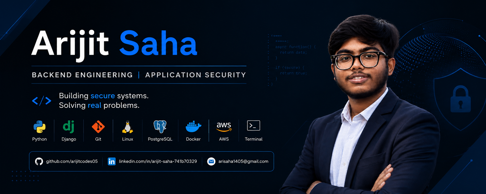

<div align="center">



<br>

# Arijit Saha

### Backend Development • Python • Django • Application Security


<br>

[](https://github.com/arijitcodes05)
[](https://www.linkedin.com/in/arijit-saha-741b70329)
[](mailto:arisaha1405@gmail.com)


</div>

---

# 👋 Hello!

I'm **Arijit**, a Computer Science (Cyber Security) student passionate about building secure backend systems.

Rather than rushing through technologies, I prefer understanding **how software works internally**—from databases and APIs to networking and application security.

My goal is to become a Backend Engineer and gradually specialize in Application Security through consistent learning and real-world projects.

---

# 🚀 Current Focus

- Backend Development with Python & Django
- Data Structures & Algorithms
- Database Management Systems
- Linux
- Networking
- Cryptography & Network Security

---

# 💡 Philosophy

> Build fewer projects.
>
> Build them properly.
>
> Understand every line of code.

I believe strong engineering comes from mastering fundamentals rather than collecting certificates or tutorials.

---

# 🛠 Tech Stack

### Languages

<p>


</p>

### Backend

<p>


</p>

### Database

<p>


</p>

### Tools

<p>


</p>

---
## 📊 GitHub Profile Summary

<div align="center">


<br><br>


<br><br>


</div>

# 📂 Featured Projects

> Every project on this profile reflects my learning journey. I focus on understanding concepts deeply before moving to the next step.

| Project | Description | Tech |
|---------|-------------|------|
| **Python Utilities** | Collection of practical Python programs and automation scripts. | Python |
| **DSA in Python** | Well-documented Data Structures & Algorithms solutions. | Python |
| **DBMS Labs** | SQL practice, schema design, normalization, and queries. | MySQL |
| **Django Notes App** | CRUD application built while learning Django fundamentals. | Django |
| **Authentication System** | User authentication with sessions and secure login. | Django |
| **REST API** *(Coming Soon)* | Building REST APIs while learning backend architecture. | Django REST |
| **Linux Journey** | Commands, notes and hands-on Linux learning. | Linux |
| **Networking Labs** | Networking concepts, protocols and practical exercises. | Networking |
| **Cloud Computing** | Cloud computing notes and lab work. | Cloud |
| **Application Security Labs** | Secure coding, cryptography and security practice. | Security |

---

# 📖 What I'm Learning

```text
Computer Science Fundamentals
        │
        ├── Python ✅
        ├── Git & GitHub ✅
        ├── DSA (In Progress)
        ├── DBMS ✅
        ├── Cryptography ✅
        ├── Linux (Learning)
        ├── Networking (Learning)
        ├── Django
        │
        ├────────────── Next ──────────────
        │
        ├── REST APIs
        ├── PostgreSQL
        ├── Docker
        ├── AWS
        ├── System Design
        └── Application Security
```

---

# 📊 Contribution Graph

<div align="center">


</div>

---

# 🎯 2026 Goals

- Build multiple Django backend projects
- Strengthen DSA problem-solving skills
- Master DBMS fundamentals
- Learn Linux and Networking deeply
- Build REST APIs
- Learn PostgreSQL
- Start contributing to Open Source
- Secure a Software Engineering Internship

---

# 🧠 Engineering Mindset

I don't believe in memorizing code.

I believe in understanding

- Why it works.
- How it works.
- How to improve it.
- How to secure it.

That mindset guides every project I build.

---

# 📚 Currently Reading & Learning

- Python Best Practices
- Django Documentation
- Database Design
- Linux Commands
- Networking Fundamentals
- Cryptography
- Secure Coding Principles
---

# 💻 Development Principles

I aim to write code that is:

- ✔️ Readable
- ✔️ Maintainable
- ✔️ Secure
- ✔️ Well Documented
- ✔️ Easy to Improve

I believe software engineering is not only about making code work—it's about making it understandable, scalable, and reliable.

---

# 🧩 Core Computer Science

| Area | Status |
|------|--------|
| Python Programming | ✅ |
| Object-Oriented Programming | ✅ |
| Data Structures & Algorithms | 🚀 Learning |
| Database Management Systems | ✅ |
| SQL | ✅ |
| Cryptography & Network Security | ✅ |
| Linux | 🚀 Learning |
| Networking | 🚀 Learning |
| Cloud Computing | 🚀 Learning |
| Django | 🚀 Building Projects |

---

# ⚡ Tools I Use

<p align="left">


</p>

---

# 🌱 Current Learning Journey

```text
Python
   │
   ▼
DSA
   │
   ▼
Django
   │
   ▼
REST APIs
   │
   ▼
PostgreSQL
   │
   ▼
Docker
   │
   ▼
Cloud
   │
   ▼
Application Security
```

---

# 📌 Pinned Repositories

Once completed, these repositories will represent my primary work.

⭐ DSA in Python

⭐ Django Notes App

⭐ Authentication System

⭐ Python Utilities

⭐ DBMS Labs

⭐ Linux Journey

⭐ Networking Labs

⭐ REST API

---

# 🤝 Let's Connect

<div align="center">

[](https://github.com/arijitcodes05)

[](https://www.linkedin.com/in/arijit-saha-741b70329)

[](mailto:arisaha1405@gmail.com)

</div>

---

# 💬 Quote

> "Strong software is built on strong fundamentals."

---

<div align="center">

### Thanks for visiting my profile!

If you find any of my repositories useful, feel free to ⭐ them.

</div>

# 📈 Continuous Improvement

I treat software engineering as a long-term journey.

Every project on this profile represents a step toward becoming a better engineer by improving:

- Programming fundamentals
- Backend development
- Secure coding practices
- Problem-solving ability
- Software design
- Code quality
- Documentation

---

# 📚 Current Focus

Instead of learning many technologies at once, I'm focusing on mastering the fundamentals first.

Current priority:

✔ Python

✔ Django

✔ Data Structures & Algorithms

✔ DBMS

✔ Linux

✔ Networking

✔ Cryptography & Network Security

After that I'll continue with

- REST APIs
- PostgreSQL
- Docker
- AWS
- System Design
- Application Security

---

# 📌 Engineering Philosophy

I believe that good software engineers don't just write code.

They understand:

• Why the code exists.

• How it scales.

• How it fails.

• How it can be secured.

That mindset is what I'm trying to build throughout my learning journey.

---

# 🤝 Open to Connect

If you're interested in backend engineering, application security, or software development, feel free to connect.

<div align="center">

[](https://github.com/arijitcodes05)

[](https://www.linkedin.com/in/arijit-saha-741b70329)

[](mailto:arisaha1405@gmail.com)

</div>

---

<div align="center">

<br><br>

### Building Secure Systems. Solving Real Problems.

<sub>
Computer Science (Cyber Security) Student • Backend Development • Python • Django
</sub>

</div>
